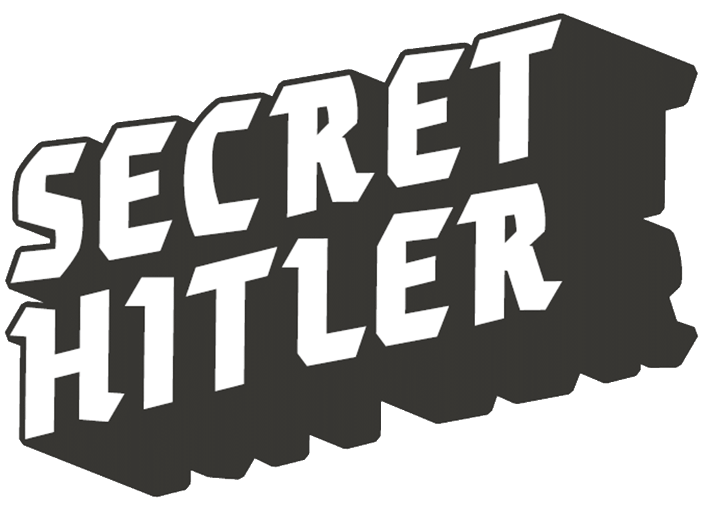

# Secret Hitler Red Dawn Edition

CAN YOU FIND AND STOP THE...  
  
  

Version 1.0.1  

## STORY
The year is 1932. The place is pre -WWII Germany. In Secret Hitler, players are German politicians attempting to hold a fragile Liberal government together and stem the rising tide of Fascism and enticement of Communism. Watch out though—there are secret factions among you trying to undermine the republic, and one player is Secret Hitler.

## GAME OVERVIEW
At the start of the game, each player is secretly assigned to one of three factions: **Liberal**, **Fascist**, or **Communist**, with one player secretly taking on the role of Hitler. The Liberals hold the majority but are in the dark about everyone’s true identities. Fascists know who Hitler is from the beginning and will use secrecy and sabotage to achieve their aims. Communists, the smallest faction, must quickly gather information and convert others to their cause to succeed, leveraging influence to shift the balance of power.  

Hitler plays for the Fascist team, and the Fascists know Hitler’s identity from the outset, but Hitler doesn’t know the Fascists and must work to figure them out.  
  
  
**The Liberals win by enacting all Liberal Policies or killing Hitler.  The Fascists win by enacting all the Fascist Policies, or if Hitler is elected Chancellor after Fascist policies enter the “Hitler Zone”. Communists win by enacting all Communist Policies or converting Hitler to communism.**  

Whenever a subversive (Fascist or Communist) party policy is enacted, the government becomes more powerful, and the **President is granted a single-use power** which must be used before the next round can begin. It doesn’t matter what team the President is on; in fact, even Liberal players might be tempted to enact a Fascist or Communist Policy to gain new powers. 

## OBJECT
Every player has a secret identity as a member of either the Liberal, Fascist or Communist team. 

Players on the ***Liberal team win*** if either:  
- All Liberal Policies are enacted.  
OR  
- Hitler is assassinated.

Players on the ***Fascist team win*** if either:  
- All Fascist Policies are enacted.  
OR  
- Hitler is elected Chancellor when Fascists are in the Hitler Zone.

Players on the ***Communist team win*** if either:  
- All Communist Policies are enacted.  
OR  
- Hitler was the target of a character assassination. Scandalous!

## GAME CONTENTS
- 17 Liberal Policy tiles
- ? Fascist Policy tiles
- ? Communist Policy tiles
- 12 Party Membership cards
- ? Secret Roles Cards
- 12 Card envelopes
- 12 Ja! Ballot cards
- 12 Nein Ballot cards
- 1 Election Tracker marker
- 2 Liberal boards
- 3 Fascist boards
- 4 Communist boards
- 1 President placard
- 1 Chancellor placard

## SET UP
You’ll need an envelope for each player, and each envelope should contain a Secret Role card, a corresponding Party Membership card, one Ja! Ballot card, and one Nein Ballot card. Use the table below to determine the correct distribution of roles.  

Liberal Secret Role cards must always be packed together with a Liberal Party Membership card, and Fascist and Hitler Secret Role (Denoted as H on the table below) cards must always be packed together with a Fascist Party Membership card.

Create single deck of policy cards, this will be a mix of Liberal, Fascist, and Communists (if applicable) policies based on the number of players in the game.  See table below. Shuffle deck and place that deck face down in the middle of the table.  

Last of all pick the single game board for each party, based on the number of players in the game per table below.  
   
| **# Players**       | 5     | 6      | 7      | 8      | 9      | 10     | 11     | 12     |
|-------------------  |------ |--------|--------|--------|--------|--------|--------|--------|
| Liberal Membership  | 3     | 3      | 4      | 4      | 4      | 5      | 5      | 5      |
| Fascist Membership  | 1+H   | 1+H    | 1+H    | 2+H    | 2+H    | 2+H    | 3+H    | 3+H    |
| Communist Membership|  0    | 1      | 1      | 1      | 2      | 2      | 2      | 3      |
| **Policy Cards**    |       |        |        |        |        |        |        |        |
| Liberal Policies    | 11    | 5      |        | 6      |        |        |        |        |
| Fascist Policies    | 6     | 10     |        | 9      |        |        |        |        |
| Communist Policies  | 0     | 8      |        | 8      |        |        |        |        |
| **Game Boards**     |       |        |        |        |        |        |        |        |
| Liberal Board       | A     | A      | A      | A      | A      | A      | A      | A      |
| Fascist Board       | A     | A      | A      | B      | B      | B/C    | C      | C      |
| Communist Board     | NA    | A      | A      | A      | B      | B      | B      | C      |

Make sure you have the correct number of ordinary Fascists in addition to Hitler!  

> WHY ARE THERE SECRET ROLE AND PARTY MEMBERSHIP CARDS?
>
> Secret Hitler features an investigation mechanic that allows some players to find out what team other players are on, and this mechanic only works if  Hitler’s special role is not revealed. To prevent that from happening, every player has both a Secret Role card and a Party Membership card. Hitler’s Party Membership card shows a Fascist party loyalty, but gives no hint about a special role. Liberals who uncover Fascists must work out for themselves whether they’ve found an ordinary Fascist or their leader.

Once each player has been dealt an envelope, all players should examine their Secret Role cards in secret. Randomly select the first Presidential Candidate and pass that player both the President and Chancellor placards.  

**For games of 5-7 players**, give the following directions to all players:
1. Everybody close your eyes.
1. Fascist and Hitler, open your eyes and acknowledge each other.   
[Take a long pause]
1. Everyone close your eyes.
1. Everyone can open your eyes. If anyone is confused or something went wrong, please tell the group now.  

**For games of 7-8 players**, give the following directions to all players: 
1. Everybody close your eyes and extend your hand into a fist in front of you.
1. All Fascists who are NOT Hitler should open their eyes and acknowledge each other. 
1. Hitler - keep your eyes closed but put your thumb out into a thumbs-up gesture.
1. Fascists, take note of who has an extended thumb - that player is Hitler.  
[Take a long pause]
1. Everyone close your eyes and put your hands down.
1. Everyone can open your eyes. If anyone is confused or something went wrong, please tell the group now.  

**For games of 11-12 players**, give the following directions to all players: 
1. Everybody close your eyes and extend your hand into a fist in front of you.
1. All Fascists who are NOT Hitler should open their eyes and acknowledge each other. 
1. Hitler - keep your eyes closed but put your thumb out into a thumbs-up gesture.
1. Fascists, take note of who has an extended thumb - that player is Hitler.  
[Take a long pause]
1. Everyone close your eyes and put your hands down.
1. Everyone can open your eyes. If anyone is confused or something went wrong, please tell the group now.  

## GAMEPLAY
Secret Hitler is played in rounds. Each round has an Election to form a government, a Legislative Session to enact a new Policy, and an Executive Action to exercise governmental power.

### ELECTION 

1.	**Pass the Presidential Candidacy**
At the beginning of a new round, the President placard moves clockwise to the next player, who is the new Presidential Candidate.

2.	**Nominate a Chancellor**
The Presidential Candidate chooses a Chancellor Candidate by passing the Chancellor placard to any other eligible player. The Presidential Candidate is free to discuss Chancellor options with the table to build consensus and make it more likely the Government gets elected.

    > **Eligibility**
    >
    > The last elected President and Chancellor are “term-limited,” and ineligible to be nominated as Chancellor Candidate.  
    > - Term limits apply to the President and Chancellor who were last elected, not to the last pair nominated. 
    >
    >- Term limits only affect nominations to the Chancellorship; anyone can be President, even someone who was just Chancellor.
    >
    >- If there are only five players left in the game, only the last elected Chancellor is ineligible to be Chancellor Candidate; the last President may be nominated.
    >
    >- There are some other rules that affect eligibility in specific ways: the Veto Power and the Election Tracker. You don’t need to worry about those yet, and we’ll talk about each one in its relevant section.

3.	**Vote on the government**
Once the Presidential Candidate has chosen an eligible Chancellor Candidate, players may discuss the proposed government until everyone is ready to vote. Every player, including the Candidates, votes on the proposed government. Once everyone is ready to vote, reveal your Ballot cards simultaneously so that everyone’s vote is public.

    - **If a majority of players votes YES**: The Presidential Candidate and Chancellor Candidate become the new President and Chancellor, respectively. 

    - **If a majority of players votes NO, or it is a TIE**:
    The vote fails. The Presidential Candidate misses this chance to be elected, and the President placard moves clockwise to the next player. The Election Tracker is advanced by one Election.  

    - **Election Tracker**: If the group rejects three governments in a row, the country is thrown into chaos. Immediately reveal the Policy on top of the Policy deck and enact it. Any power granted by this Policy is ignored, but the Election Tracker resets, and existing term-limits are forgotten. All players become eligible to hold the office of Chancellor for the next Election. If there are fewer than three tiles remaining in the Policy deck at this point, shuffle them with the Discard pile to create a new Policy deck.

        > Any time a new Policy tile is played face-up, the Election Tracker is reset, whether it was enacted by an elected government or enacted by the frustrated populace.

    - **If three or more Fascist Policies have been enacted already**: Ask if the new Chancellor is Hitler. If so, the game is over and the Fascists win. Otherwise, other players know for sure the Chancellor is not Hitler. 

    - Proceed as usual to the Legislative Session.  

### LEGISLATIVE SESSION
During the Legislative Session, the President and Chancellor work together to enact a new Policy in secret. The President draws the top three tiles from the Policy deck, looks at them in secret, and discards one tile face down into the Discard pile. The remaining two tiles go to the Chancellor, who looks in secret, discards one Policy tile face down, and enacts the remaining Policy by placing the tile face up on the corresponding track.

Verbal and nonverbal communication between the President and Chancellor is forbidden. The President and Chancellor MAY NOT pick Policies to play at random, shuffle the tiles before discarding one, or do anything else clever to avoid secretly and intentionally selecting a Policy.  

Additionally, the President should hand both Policies over at the same time, rather than one at a time to gauge the Chancellor’s reaction. Attempting to telegraph the contents of your hand using randomness or any other unusual selection procedure violates the spirit of the game. Don’t do it.

**Discarded Policy tiles should never be revealed to the group. Players must rely on the word of the President and Chancellor, who are free to lie.**  

> ABOUT LYING: Often, some players learn things that the rest of the players don’t know, like when the President and Chancellor get to see Policy tiles, or when a President uses the Investigate power to see someone’s Party Membership card. You can always lie about hidden knowledge in Secret Hitler. The only time players MUST tell the truth is in game-ending, Hitler-related scenarios: a player who is Hitler must say so if assassinated or if elected Chancellor after three Fascist Policies have been enacted.
If there are fewer than three tiles remaining in the Policy deck at the end of a Legislative Session, shuffle them with the Discard pile to 

create a new Policy deck. Unused Policy tiles should never be revealed, and they should not be simply placed on top of the new Policy deck.

If the government enacted a Fascist Policy that covered up a Presidential Power, the sitting President gets to use that power. Proceed to the Executive Action.

If the government enacted a Liberal Policy or a Fascist Policy that grants no Presidential Power, begin a new round with a new Election.
EXECUTIVE ACTION

If the newly-enacted Fascist Policy grants a Presidential Power, the President must use it 
before the next round can begin. Before using a power, the President is free to discuss the issue with other players, but ultimately the President gets to decide how and when the power is used. Gameplay cannot continue until the President uses the power. Presidential Powers are used only once; they don’t stack or roll over to future turns.
VETO POWER

The Veto Power is a special rule that comes into effect after five Fascist Policies have been enacted. For all Legislative Sessions after the fifth Fascist Policy is enacted, the Executive branch gains a permanent new ability to discard all three Policy tiles if both the Chancellor and President agree.

The President draws three Policy tiles, discards one, and passes the remaining two to the Chancellor as usual. Then Chancellor may, instead of enacting either Policy, say “I wish to veto this agenda.” If the President consents by saying, “I agree to the veto,” both Policies are discarded and the President placard passes 

to the left as usual. If the President does not consent, the Chancellor must enact a Policy
as normal.

Each use of the Veto Power represents an inactive government and advances the Election Tracker by one.  

## STRATEGY NOTES
1. Everyone should claim to be a Liberal. Since the Liberal team has a voting majority, it can easily shut out any player claiming to be a Fascist. As a Fascist, there is no advantage to outing yourself to the majority. Additionally, Liberals should usually tell the truth. Liberals are trying to figure out the game like a puzzle, so lying can put their team at a significant disadvantage.

2. If this is your first time playing Hitler, just remember: be as Liberal as possible. Enact Liberal Policies. Vote for Liberal governments. Kiss babies. Trust your fellow Fascists to create opportunities for you to enact Liberal Policies and to advance Fascism on their turns. The Fascists win by subtly manipulating the table and waiting for the right cover to enact Fascist Policies, not by overtly playing as evil.

3. Liberals frequently benefit from slowing play down and discussing the available information. Fascists frequently benefit from rushing votes and creating confusion.

4. Fascists most often win by electing Hitler, not by enacting six Policies! Electing Hitler isn’t an optional or secondary win condition, it’s the core of a successful Fascist strategy. Hitler should always play as a Liberal, and should generally avoid lying or getting into fights and disagreements with other players. When the time comes, Hitler needs the Liberals’ trust to get elected. Even if Hitler isn’t ultimately elected, the distrust sown among Liberals is key to getting Fascists elected late in the game.

5. Ask other players to explain why they took an action. This is especially important with Presidential Powers—in fact, ask ahead of time whom a candidate is thinking of investigating/appointing/assassinating.

6. If a Fascist Policy comes up, there are only three possible culprits: The President, the Chancellor, or the Policy Deck. Try to figure out who (or what!) put you in this position.

## PRESIDENTIAL POWERS
This section explains in more details the presidential powers granted by passing a policy as outlined on the Fascist and Communist game boards.  No need to read now, refer to as needed.

### FASCIST PRESIDENTIAL POWERS

1.	**Investigate Loyalty** 
The President chooses a player to investigate. Investigated players should hand their Party Membership card (not Secret Role card!) to the President, who checks the player’s loyalty in secret and then returns the card to the player. The President may share (or lie about!) the results of their investigation at their discretion. No player may be investigated twice in the same game.

2.	**Call Special Election**
The President chooses any other player at the table to be the next Presidential Candidate by passing that player the President placard. Any player can become President—even players that are term-limited. The new President nominates an eligible player as Chancellor Candidate and the Election proceeds as usual.

    - A Special Election does not skip any players. After a Special Election, the President placard returns to the left of the President who enacted the Special Election. 
    
    - If the President passes the presidency to the next player in the rotation, that player would get to run for President twice in a row: once for the Special Election and once for their normal shift in the Presidential rotation.
    

3.	**Policy Peek**
The President secretly looks at the top three tiles in the Policy deck and then returns them to the top of the deck without changing the order.

4.	**Execution**
The President executes one player at the table by saying “I formally execute [player name].” If that player is Hitler, the game ends in a Liberal victory. If the executed player is not Hitler, the table should not learn whether a Fascist or a Liberal has been killed; players must try to work out for themselves the new table balance. Executed players are removed from the game and may not speak, vote, or run for office.

### COMMUNIST PRESIDENTIAL POWERS

1.	**Bugging**
The communists look at another player’s party membership card. When this power is activated, give the following instructions:

    > 1. Everyone take out your Party membership card and place it face down in front of you.
    > 1. Everyone close your eyes
    > 1. Communists open your eyes
    > 1. You must look at one players party membership card together.  
    > [Take a long pause]
    > 1. Communists close your eyes
    > 1. Everyone reach out and move your card around slightly
    > 1. Everyone open your eyes.

## CREDITS & LICENSE
See LICENSE in GitHub: 
https://github.com/iFreeon/secret-hitler-red-dawn-expansion/blob/main/LICENSE

## TODO
WIP items, that need some love.
1. Explain Hitler Zone
2. Explain what happens if Hitler is converted to Communism.  It will not work.. but the Communists don't know that and assume the person is converted.
3. Character Assassination - Win condition for Communists when Hitler is selected.  Explain how this works and how it pull characters into the media spotlight and forces them to leave the shadows of Fascism or Communism and instantly turn into a liberal.
4. Work on player 10-12 script.
5. Update presidential powers.
6. Update game contents.
7. Work on policy mix.

